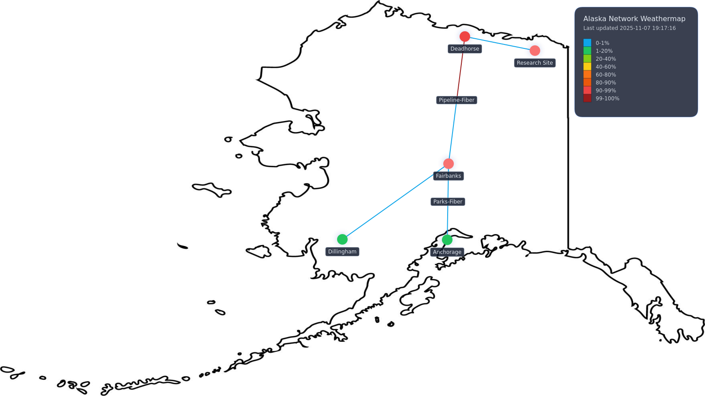

# TS Weathermap

A modern TypeScript re-imagining of the classic network weathermap: real-time
SNMP polling, dynamic back-end streaming, and a canvas-based front-end for
at-a-glance infrastructure health.



## Features

- **Real-time telemetry** – The backend polls every configured router interface,
  tracks 64-bit counters, and streams utilisation deltas over WebSockets.
- **Config-driven topology** – Describe routers, their canvas positions, and
  interconnecting links in `data/config.yaml`.
- **Adaptive visuals** – The front-end auto-fits your background map,
  colour-codes utilisation buckets, and surfaces hot links and interface stats
  in an interactive heads-up display.
- **Curved links** – Parallel links curve around each other automatically, and
  you can override the path with custom waypoints when you need precise routing.
- **Layout mode** – Drag routers directly on the canvas and copy the generated
  coordinates back into `config.yaml`.
- **Hot reloading** – Configuration changes are detected on the fly; connected
  browsers receive updated topology metadata instantly.
- **Shareable snapshots** – Every polling interval the backend exports a
  rendered PNG to `/app/data/image_data/` and serves the latest image at
  `/map.png` so you can expose a read-only view without credentials.

## Getting Started

```bash
npm install
npm run build
npm start
```

Open your browser to `http://localhost:3000` to view the most recent rendered
PNG (also available at `/map.png`). The interactive management UI now lives at
`http://localhost:3000/manage`. By default the server reads
`/app/data/config.yaml` and `/app/data/background.png`. The
repository’s `data/` directory is copied into that location during Docker
builds and is bind-mounted via `docker-compose.yml` for local development. If
you prefer to run `npm start` directly, create a symlink or bind mount so that
`/app/data` points to your desired config folder.

- `PORT` – port for the HTTP/WebSocket server (defaults to `3000`)

### Docker / Compose

To run everything inside containers (recommended so `/app/data` is managed for
you):

```bash
docker compose up --build
```

This builds the image, binds `./data` to `/app/data`, and exposes the app on
port `3000`.

### Snapshot Endpoint

Every poll the backend renders a PNG of the current map (background, links,
routers, legend, timestamp) and writes it to `/app/data/image_data/` using the
file name pattern `yyyy-mm-dd-hh-mm-ss.png`. The most recent image is available
at `http://localhost:3000/map.png`, which you can serve publicly because it
contains no SNMP credentials or raw topology data.

## Configuration Overview

All topology and polling details live in `data/config.yaml`, which is copied (or
mounted) into `/app/data/config.yaml` at runtime. A minimal outline:

```yaml
meta:
  title: "Sample Network Weathermap"
  poll_interval_ms: 5000

map:
  background: background.png
  size:
    width: 1600   # Canvas coordinate space
    height: 900

routers:
  core1:
    label: "Core 1"
    ip: 10.0.0.1
    community: public
    position: { x: 450, y: 450 }  # Canvas coordinates
    interfaces:
      - name: uplink_edge1
        display_name: "Core → Edge 1"
        oid_in: .1.3.6.1.2.1.2.2.1.10.2
        oid_out: .1.3.6.1.2.1.2.2.1.16.2
        max_bandwidth: 1000000000  # Optional static fallback (bits per second)
        oid_speed: .1.3.6.1.2.1.2.2.1.5.2  # Optional dynamic bandwidth OID

links:
  - id: core-edge1
    from: core1
    to: edge1
    iface_from: uplink_edge1
    iface_to: core_feed
    label: "Core ↔ Edge 1"
  - id: core-edge2
    from: core1
    to: edge2
    iface_from: uplink_edge2
    iface_to: core_feed
    label: "Core ↔ Edge 2"
    path:
      - { x: 780, y: 560 }
      - { x: 920, y: 640 }
```

### Tips

- Place routers using the same coordinate system as your background image
  (`map.size`).
- Each link references interfaces by name; validation errors surface in the
  server logs if something is misconfigured.
- You can provide either a fixed `max_bandwidth` (in bits per second) or an
  `oid_speed` (or both). When an OID is supplied the poller refreshes the
  interface bandwidth every cycle and falls back to the static value if the OID
  is missing or invalid.
- `map.background` only accepts a file name. Any path segments are stripped so
  the asset must live alongside `config.yaml` in `/app/data`.
- Links that share the same pair of routers are automatically fanned out with
  curved arcs. Add the optional `path` array (see above) if you need to draw
  very specific bends or detours.

## Development

- `npm run dev` – TypeScript compiler in watch mode.
- `npm run build` – Bundles both backend and frontend with esbuild.
- `npm start` – Launches the Express/WebSocket backend (requires a prior build).

Hot reload behaviour:

- The backend reloads `config.yaml` automatically.
- Browsers receive the new topology immediately and reuse the active WebSocket
  connection.

### Layout Mode

- Click the “Layout Mode” button in the HUD (or press `Esc` to exit).
- Drag any router on the canvas; curved links recompute live so you can untangle
  overlaps.
- Copy the generated JSON snippet (bottom of the HUD) into `config.yaml` to
  persist coordinates.

## License

MIT – see [`LICENSE`](LICENSE).
