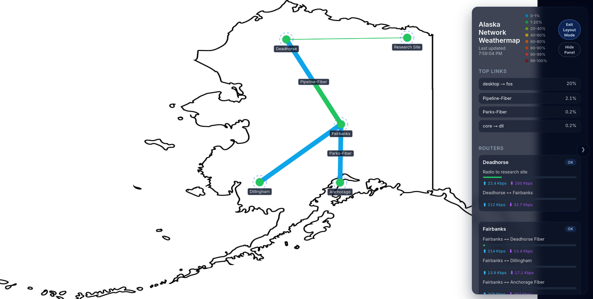

# TS Weathermap

A modern TypeScript re-imagining of the classic network weathermap: real-time
SNMP polling, dynamic back-end streaming, and a canvas-based front-end for
at-a-glance infrastructure health.


## Features

- **Real-time data updates**: Polls SNMP data from all configured endpoints at
  a configured interval.
- **Simple setup**: Everything lives in one glorious config.yaml file,
  including routers, links, positions, and settings. No database required.
- **Smart visuals**: Provide your own background.png; link positions line up
  with your image coordinates.
- **Customizable links**: Define your own link paths right in the config for
  total layout control.
- **Admin page**: Manage the app at `/manage`. You’ll want to secure this (and
  the `/api` endpoint) behind Nginx with some authentication.
- **Safe for sharing**: `/` and `/map.png` serve a read-only rendered map. No
  sensitive data is exposed — just color-coded utilization and topology lines.
  The map image updates automatically, and historical snapshots are saved for
  later use (like building time-lapse animations!).

### Docker / Compose

Build and run the project using Docker and Docker Compose. Ensure you have
Docker and Docker Compose installed. Then, you can use the provided
`docker-compose.yml` file to pull the latest image (or use `docker-compose-local.yml`
to build locally) and spin up the application.

```bash
git clone https://github.com/k-katfish/ts-weathermap.git
cd ts-weathermap
mkdir data
# Copy your config.yaml and background.png into the data/ directory

# Run with Docker Compose
docker compose up -d
```

Just browse to `http://localhost:3000` to see the application in action.

At this point it's _highly_ recommended that you throw nginx (or another proxy)
in front of the app to handle TLS and authentication for the management UI and
API endpoints. See [NGINX][#nginx-setup] below for a sample config.

### Snapshot Endpoint

Every poll the backend renders a PNG of the current map (background, links,
routers, legend, timestamp) and writes it to `/app/data/image_data/` using the
file name pattern `yyyy-mm-dd-hh-mm-ss.png`. The most recent image is available
at `http://localhost:3000/map.png`, which you can serve publicly because it
contains no SNMP credentials, metrics, topology details, or sensitive info.

This is great for embedding in dashboards, status pages, or even building
time-lapse videos of your network health over time!

Right now, the app doesn't do anything with the historical snapshots, but you
can easily grab them from the `image_data/` folder inside the volume to make
your own animations or archives.

> NOTE! Beware of disk space usage, this app will generate images over time and
> does not implement any pruning or cleanup logic. Consider setting up a cron
> job or similar to delete old images.

## Configuration Overview

All topology and polling details live in `data/config.yaml`, which is mounted
into `/app/data/config.yaml` at runtime. A minimal outline:

```yaml
meta:
  title: "My Weathermap"
  poll_interval_ms: 5000

map:
  background: background.png
  size:
    width: 1600   # Canvas coordinate space
    height: 900

routers:
  core1:
    label: "Core 1"
    ip: 10.0.0.1
    community: public
    position: { x: 450, y: 450 }  # Canvas coordinates
    interfaces:
      - name: uplink_edge1
        display_name: "Core → Edge 1"
        oid_in: .1.3.6.1.2.1.2.2.1.10.2
        oid_out: .1.3.6.1.2.1.2.2.1.16.2
        max_bandwidth: 1000000000  # Optional static fallback (bits per second)
        oid_speed: .1.3.6.1.2.1.2.2.1.5.2  # Optional dynamic bandwidth OID
        oid_speed_scale: 1000              # Multiply speed value before use

links:
  - id: core-edge1
    from: core1
    to: edge1
    iface_from: uplink_edge1
    iface_to: core_feed
    label: "Core ↔ Edge 1"
  - id: core-edge2
    from: core1
    to: edge2
    iface_from: uplink_edge2
    iface_to: core_feed
    label: "Core ↔ Edge 2"
    path:
      - { x: 780, y: 560 }
      - { x: 920, y: 640 }
```

### Tips

- Place routers using the same coordinate system as your background image. Also,
  feel free to just make up some numbers, then use the editor to place them
  visually and copy the coordinates back into the config later.
- Each link references interfaces by name; validation errors surface in the
  server logs if something is misconfigured.
- You can provide either a fixed `max_bandwidth` (in bits per second) or an
  `oid_speed` (or both). When an OID is supplied the poller refreshes the
  interface bandwidth every cycle and falls back to the static value if the OID
  is missing or invalid. Use `oid_speed_scale` to multiply the raw SNMP value
  (helpful if the device reports Kbps/Mbps instead of bps).
- `map.background` only accepts a file name. Any path segments are stripped so
  the asset must live alongside `config.yaml` in `/app/data`.
- Links that share the same pair of routers are automatically fanned out with
  curved arcs. Add the optional `path` array (see above) if you need to draw
  very specific bends or detours.

### Layout Mode

- Click the “Layout Mode” button in the HUD (or press `Esc` to exit).
- Drag any router on the canvas; curved links recompute live so you can untangle
  overlaps.
- Copy the generated JSON snippet (bottom of the HUD) into `config.yaml` to
  persist coordinates.



## License

MIT – see [`LICENSE`](LICENSE).
